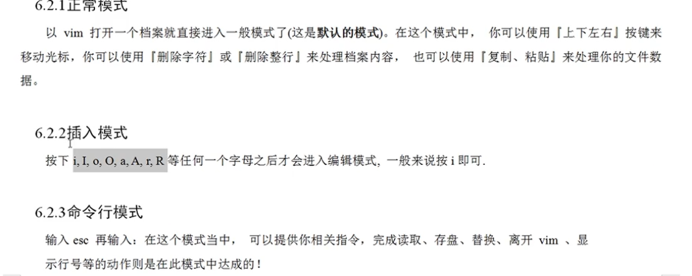
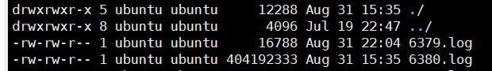

[安装](https://www.bilibili.com/video/BV1Sv411r7vd?p=6&vd_source=657f97937fa615321b191e72446bf992)

## 概要

注意本操作只为最简单最基本的操作，学会这些只能应付平时的70%的场景，遇到问题要多查多练。

这些大部分都是文件操作之类的，后面还有**用户权限**、**网络管理**、**进程信息**、**shell脚本编程**等等等等

#### 基本中的基本操作

- cd
- ls 
  - -a
  - -l
- mkdir 创建文件夹
- touch 创建新文件
- cp 
- rm指令
  - rm -rf /*
- mv
- more
- cat
- more
- tar

#### vim基础

#### 权限管理基础中基础

## 具体操作

### 基础

### ls

```shell
$ls [选项] [目录或文件]
```

- -a 像是当前目录的所有文件和目录，包括隐藏的
- -l 以列表的方式显示信息
- -h human适合人类阅读的方式展示，如单位使用M等
- 可以叠加使用

### cd

```bash
$cd [参数] 
```

切换到指定的目录，相对路径和绝对路径均可

```bash
#cd .. 返回上一级目录
#cd ~ 返回家目录
```

### mkdir

mkdir用于创建目录

```bash
#mkdir [选项] 要创建的目录
```

- -p 创建多级目录

```bash
#mkdir -p /home/animal/tiger
```

### rmdir

删除非空目录

```bash
#rmdir [选项] 要删除的目录
```

- 如果目录下不为空，就无法删除
- 删除非空目录使用 rm -rf 要删除的目录

```bash
#rm -rf /home/animal
```

### touch

创建空文件

```bash
#touch 文件名
```

### cp

拷贝文件到指定目录

```bash
#cp [选项] sourve dest
```

- -r 递归复制整个文件夹
- 在cp前加一个/ 默认覆盖不再提醒

例如讲/home/hello.txt 拷贝到/opt/bbb目录下

```bash
# cp -r /home/ /opt/bbb
```

### rm指令

移除文件或目录

```bash
# rm [选项] 要移除的文件或目录
```

- -r 递归删除整个文件夹
- -f 强制删除不提示

```bash
# rm -rf /
删库跑路
```

### mv

移动文件与目录或重命名

```bash
# mv oldNameFile newNameFile (同一目录下重命名)
# mv /temp/movefile /targeFolder (不同目录下移动文件)
```

- 如果目标文件最终为文件为不是目录就是移动并重命名

### cat

查看文件内容

```bash
# cat [选项] 要查看的文件
```

- -n 显示行号
- 相对于vi和vim只读模式更加安全
- cat只能浏览不能修改，为了方便浏览一般加上管道命令 ` | more`

```bash
# cat -n /etc/profile | more [进行]
```

### grep 和 |

grep 过滤查找，管道符|，表示将前一个命令的处理结果传递给后面的命令处理

```bash
# grep [选项] 查找内容 源文件
```

- -n 显示匹配的行及行号
- -i 忽略字母大小写

### 压缩和解压

### *gzip/gunzip

```bash
# gzip 文件 （压缩文件，只能压缩为*.gz文件）
# gunzip 文件.gz (解压缩文件)
```

### *zip/unzip

zip用来压缩文件，unzip用来解压

```bash
# zip [选项] xxx.zip 将要压缩的内容 （压缩并命名）
# unzip [选项] xxx.zip （解压文件
```

- -r 递归压缩，即压缩目录
- -d <目录>  指定解压后文件的存放位置

### tar

jdk.tar.gz

tar 指令即使打包又是解压，最后打包的文件是`.tar.gz`的文件

```bash
# tar [选项] xxx.tar.gz 打包的内容 （打包目录，压缩的文件格式为tar.gz
```

- -c 产生.tar打包文件
- -v 显示详细信息
- -f 指定压缩后的文件名
- -z 打包同时压缩
- -x 解压.tar文件

```bash
# tar -zcvf newName sourceNaem (压缩)
# tar -zxvf name (解压)
```

## Vim

- 指令模式
- 输入模式
- 底线模式


### 模式介绍



### 查用指令

#### 底线模式

- q 退出    q!	强制退出 不保存
- wq 保存后退出
- set nu 显示行数
- set nonu 隐藏行数

#### 指令模式；

- /关键字 回车查找 n下一个
- 跳转到首行gg和尾行G
- 输入数字后 shift+g 跳转到指定行
- u 撤销动作
- 还有拷贝（yy   +    p）和删除(dd)使用不是很多，因为就我自身而言，建议大家手动操作，因为批处理容易因为马虎出错

## 用户权限基础



### 第0位表示文件类型

- d 目录
- `-`文件
- l 链接（相当于win的快捷方式）
- c 字符设备文件，入键盘鼠标等
- b是块设备，如硬盘等

wxr wxr wxr

### 第1-3表示所有者权限

--User

### 第4-6为表示所属组的权限

--Group

### 第7-9位表示其他用户的权限

--Other

### 修改权限

rwx = 4+2+1 = 7

user : 7

group :5 

- u:user
- g:group
- o:other
- a:all

`chmod u=rwx,g=rx,o=x `  相当于` chmod 751`

`chmod u+w 为u添加写操作`