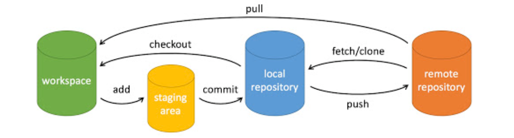

# git使用流程

## 寻找资源

在`github`或`gitee码云`等寻找自己喜欢的资源或者要参与的项目  

## Fork

将开源项目或者公司项目Fork到自己的仓库

## clone

将fork到自己仓库的代码克隆到本地仓库

## 完成编码

## add .

将文件追踪到暂存区

## commit

将修改的代码提交到本地仓库

## pull

提交前再次拉取请求，尽可能与远程仓库保持一致避免发生代码冲突

## push

将本地仓库的代码提交到远程仓库

## 申请PR

在GitHub提交一个PR等待管理员合并分支

# 注意事项

- pull	每次提交代码的时候必须进行一次pull
- commit 提交信息要规范，不能每次都是一个update
- 和远程仓库挂钩的最好都带上分支名字
  - 如果 clone -b 分支 仓库url
  - push origin develop:develop

# 后续学习

- 冲突解决
- 日志
- 回滚
- 快捷键设置
- 等等等