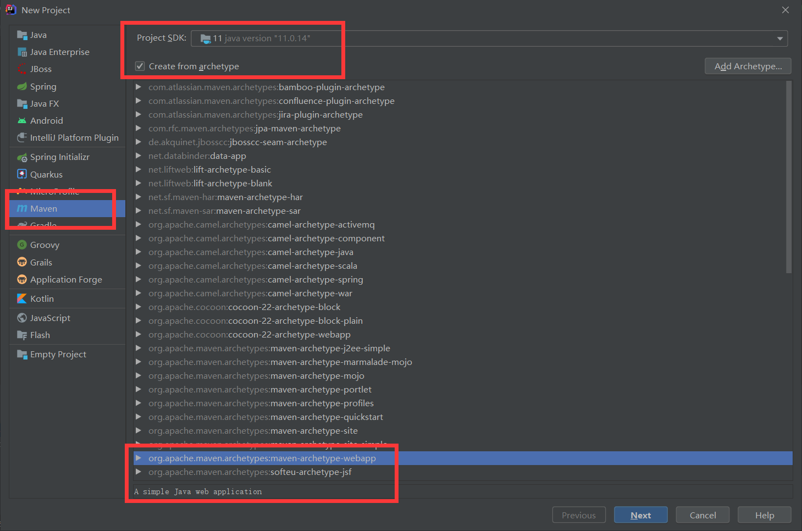
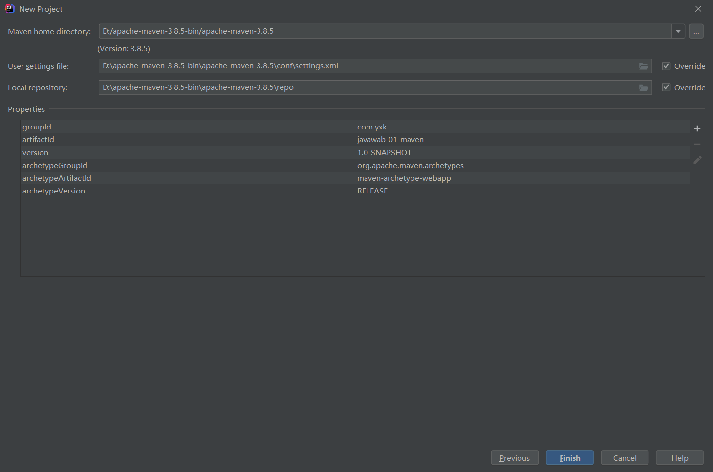
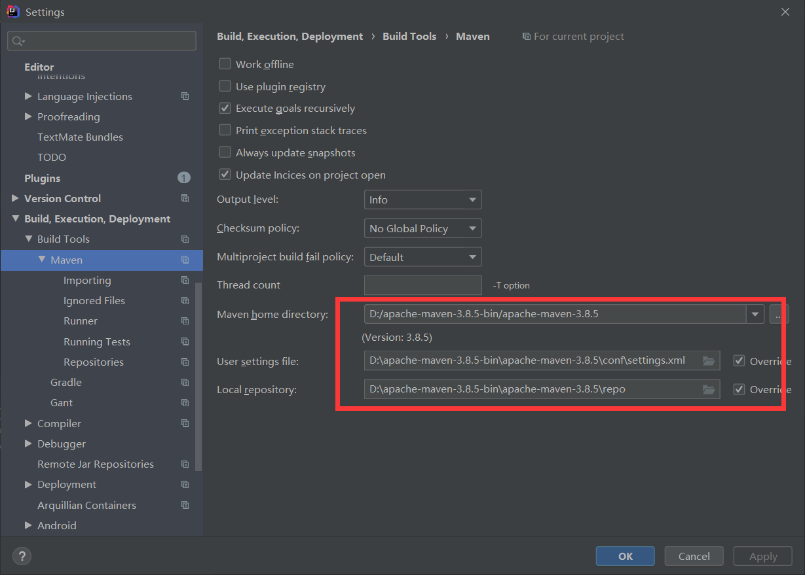
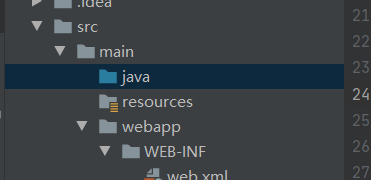
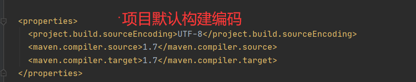

# MAVEN

Maven作为一个构建工具，不仅能帮我们自动化构建，还能够抽象构建过程，提供构建任务实现;它跨平台，对外提供了一致的操作接口，这一切足以使它成为优秀的、流行的构建工具。

Maven不仅是构建工具，还是一个依赖管理工具和项目管理工具，它提供了中央仓库，能帮我自动下载构件。

# 下载

- 下载需要先保证电脑有jdk环境
- 去[Maven官网](https://link.juejin.cn/?target=http%3A%2F%2Fmaven.apache.org%2Fdownload.cgi)下载界面下载想要的版本解压到你想要的目录就行
- 设置一下环境变量，将Maven安装配置到操作系统环境中，主要就是配置**M2_HOME **和**PATH**两项

# 使用

### 设置镜像:

```xml
<mirrors>
 	 <mirror>
      <id>alimaven</id>
      <name>aliyun maven</name>
      <url>http://maven.aliyun.com/nexus/content/groups/public/</url>
      <mirrorOf>central</mirrorOf>        
    </mirror>
  </mirrors>

```

### 本地仓库：

```xml
 <localRepository>D:\apache-maven-3.8.5-bin\apache-maven-3.8.5\repo</localRepository>
```

### IDEA创建项目











# 注意事项

- 一定检查idea使用的maven版本
- maven命令
- 补充知识：https://juejin.cn/post/6844903543711907848